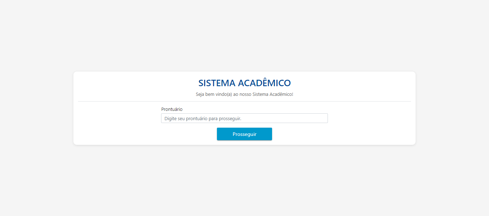
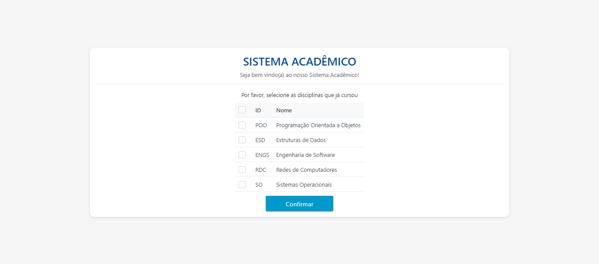
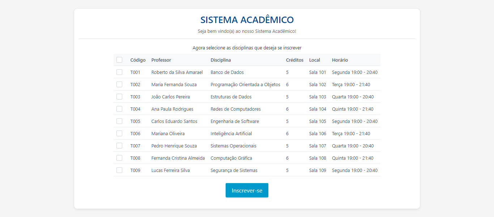

# Sistema Acadêmico

Este projeto é um sistema desenvolvido como trabalho da disciplina de Qualidade de Software. Ele implementa o caso de uso "Realizar Inscrição" descrito no livro "Principios de Análise e Projeto de Sistemas com UML 3ed - Eduardo Bezerra". O sistema permite que usuários se inscrevam em disciplinas, considerando pré-requisitos e disponibilidade.

## Visão Geral

O sistema segue um fluxo estruturado onde os estudantes inserem seu número de prontuário para iniciar o processo de inscrição. Em seguida, eles especificam as disciplinas que já cursaram (pré-requisitos) e selecionam as disciplinas nas quais desejam se inscrever. Com base nessas informações, o sistema verifica se o estudante atende aos pré-requisitos para cada disciplina selecionada. Se os pré-requisitos forem atendidos, o estudante pode prosseguir com a inscrição. Caso contrário, ele tem a opção de entrar em uma lista de espera para disciplinas que estão com vagas esgotadas.

## Tecnologias Utilizadas

- **Node.js**: Ambiente de execução backend
- **Express.js**: Framework web para Node.js
- **TypeScript**: Superset tipado do JavaScript
- **Jest**: Framework de testes JavaScript
- **Istanbul**: Ferramenta de cobertura de código

## Funcionamento

### Tela Inicial

### Seleção de Disciplinas já cursadas

### Seleção de Disciplinas desejadas

## Créditos

Este projeto foi desenvolvido por [João Vitor Tadeo] e [Felipe Rodrigues Gonçalves] para a disciplina de Qualidade de Software no [Instituto Federal de Educação, Ciência e Tecnologia de São Paulo]. O design foi inspirado pelo caso de uso "RealizarInscricao" do livro "Principios de Análise e Projeto de Sistemas com UML 3ed - Eduardo Bezerra".
